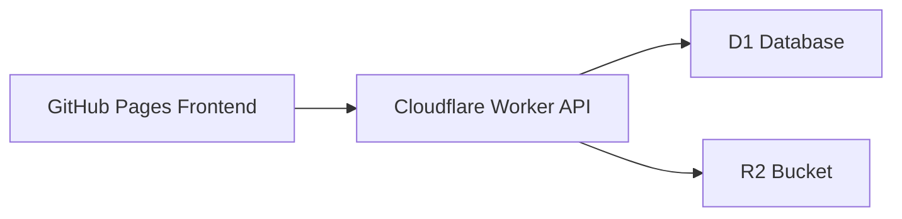

# FriendCircle Cloudflare Backend Design

Date: 2026-07-01
Status: Approved for implementation once reviewed
Decision: Keep the existing static frontend and add a Cloudflare-backed API using Workers, D1, and R2.

## Goal

Upgrade the current FriendCircle demo site into a small shared app for four known people.

The app must support:

- shared activity records
- shared comments
- shared settlement data
- private photo uploads
- private file attachments

The app does not need a full consumer-grade account system. Instead, each of the four members will authenticate with a personal passcode, and the system will remember the current member between visits until logout or session expiry.

## Why This Approach

The current site already works well as a static frontend. The missing capability is shared persistence.

Cloudflare Workers + D1 + R2 is the selected backend because it matches the project shape well:

- Workers provide a lightweight API without managing a server
- D1 provides relational storage for activities, comments, memberships, and sessions
- R2 provides object storage for photos and attachments
- the architecture stays small enough for a four-person private app

This is intentionally lighter than a full auth product and more flexible than trying to force persistent shared state into a static-only site.

## High-Level Architecture

The frontend remains a static site. It calls a Worker API over HTTPS.

Core interaction model:

1. A member opens the site
2. If no active session is present, they enter their personal passcode
3. The Worker validates the passcode and creates a short-lived session
4. The browser stores the returned session token locally
5. All record, comment, and attachment actions go through the Worker using that token
6. The Worker reads and writes structured data in D1 and files in R2

## Identity Model

There are exactly four members. Each member has:

- a fixed identity record
- a display name
- a personal passcode
- an active/inactive status

No public signup exists.

### Login behavior

- Each member enters their own personal passcode
- A passcode maps to exactly one member
- Successful login returns the member identity and a session token
- The frontend stores the session token in browser storage
- On later visits, the frontend calls the session status endpoint to restore identity automatically
- A logout action clears the stored token and invalidates the session server-side

### Security model

- Passcodes are never stored in plaintext
- The Worker stores only passcode hashes in D1
- Session tokens are random opaque values
- D1 stores only a hash of the session token, not the raw token
- Sessions have expiration timestamps and can be revoked
- API write routes require a valid session

This is not intended to defend against a determined attacker with device access. It is intended to provide lightweight member separation for a small trusted group.

## Data Model

The data model is relational in D1.

### `members`

Stores the four known people.

Fields:

- `id`
- `slug`
- `display_name`
- `accent_key`
- `is_active`
- `created_at`

### `member_credentials`

Stores the passcode hash for each member.

Fields:

- `member_id`
- `passcode_hash`
- `created_at`
- `rotated_at`

### `sessions`

Stores active and historical sessions.

Fields:

- `id`
- `member_id`
- `token_hash`
- `created_at`
- `expires_at`
- `last_seen_at`
- `revoked_at`

### `activities`

Stores the main activity record.

Fields:

- `id`
- `title`
- `activity_type`
- `activity_date`
- `location`
- `notes`
- `created_by_member_id`
- `created_at`
- `updated_at`

### `activity_participants`

Stores which members joined an activity.

Fields:

- `activity_id`
- `member_id`

### `activity_scores`

Stores per-member score or gain/loss data for one activity.

Fields:

- `id`
- `activity_id`
- `member_id`
- `score_delta`
- `rank_order`
- `is_winner`

### `activity_settlements`

Stores reimbursement or cost-sharing lines.

Fields:

- `id`
- `activity_id`
- `from_member_id`
- `to_member_id`
- `amount`
- `note`

### `comments`

Stores comments attached to an activity.

Fields:

- `id`
- `activity_id`
- `member_id`
- `body`
- `created_at`

### `attachments`

Stores metadata for files that live in R2.

Fields:

- `id`
- `activity_id`
- `uploaded_by_member_id`
- `r2_object_key`
- `original_filename`
- `mime_type`
- `byte_size`
- `attachment_kind`
- `created_at`

## Object Storage Model

All photos and attachments are stored in a private R2 bucket.

The bucket should not be exposed directly as a public asset origin for this app.

Instead:

- uploads are sent to the Worker
- the Worker writes the object to R2 using its bucket binding
- downloads and previews are served back through Worker routes after session validation

This keeps access control in one place and avoids leaking file URLs publicly.

Suggested R2 key layout:

- `activities/<activity-id>/photos/<attachment-id>-<safe-name>`
- `activities/<activity-id>/files/<attachment-id>-<safe-name>`

## API Shape

The Worker exposes a small REST-style API.

### Session routes

- `POST /api/session/login`
  Input: personal passcode
  Output: member profile + session token

- `GET /api/session/me`
  Input: bearer token
  Output: current member identity or unauthorized

- `POST /api/session/logout`
  Input: bearer token
  Effect: revoke session and clear frontend state

### Activity routes

- `GET /api/activities`
  Returns activity summaries for the home page

- `GET /api/activities/:id`
  Returns one activity with scores, settlements, comments, and attachment metadata

- `POST /api/activities`
  Creates a new activity, its participants, scores, and settlements

### Comment routes

- `POST /api/activities/:id/comments`
  Adds one comment under the current member identity

### Attachment routes

- `POST /api/activities/:id/attachments`
  Accepts one multipart upload and stores metadata in D1 plus bytes in R2

- `GET /api/attachments/:id`
  Streams a protected attachment after validating the session

## Frontend Integration

The current static pages should remain in place and be upgraded rather than replaced.

### Existing pages to extend

- `index.html`
  Replace static recent activity data with API-loaded data

- `stats.html`
  Replace static leaderboard and settlement sections with API-derived data

- `record.html`
  Convert the current demo form into a real create-activity form

- `detail.html`
  Load one activity by id and allow real comments and attachment views

### New frontend behavior

- on startup, check for a stored session token
- if no session exists, show a simple passcode gate
- after login, cache the member identity client-side
- submit record, comment, and upload actions to Worker endpoints
- refresh page data after successful writes

The frontend does not need realtime subscriptions. Manual refresh or post-submit reload is enough for this version.

## CORS and Environment Boundaries

Because the frontend may remain on GitHub Pages while the backend lives on a Worker domain, the Worker must explicitly support cross-origin requests.

Allowed origins should include:

- the production GitHub Pages origin
- localhost development origins used during local preview

The Worker should reject unexpected origins for write routes.

## Secrets and Configuration

Sensitive values belong in Worker secrets, not in frontend files.

Required secret/config categories:

- session signing secret or token generation secret
- optional upload size constraints
- allowed frontend origins

Bindings should include:

- one D1 binding
- one R2 binding

Cloudflare docs consulted for this design:

- Workers bindings: https://developers.cloudflare.com/workers/runtime-apis/bindings/
- D1 Worker API: https://developers.cloudflare.com/d1/worker-api/
- R2 Workers API: https://developers.cloudflare.com/r2/api/workers/workers-api-reference/
- Workers secrets: https://developers.cloudflare.com/workers/configuration/secrets/

## Error Handling

The Worker should return clear JSON errors for the frontend to render.

Expected cases:

- invalid passcode
- expired session
- unauthorized write
- missing activity
- invalid file type
- attachment too large
- unsupported upload payload

Frontend behavior:

- show inline messages for login and form failures
- keep draft form values when submission fails
- show upload errors without wiping the whole record form

## Privacy and Operational Tradeoffs

This system is private-by-convention for a trusted group, not enterprise-grade identity.

Important tradeoffs:

- browser storage for the session token is simpler than cross-origin cookie auth
- a stolen browser token could impersonate a member until session expiry or logout
- all four people are trusted participants, so this is acceptable for the first version

If stronger auth is needed later, the system can migrate to Cloudflare Access, formal email login, or a same-origin frontend hosted on Cloudflare Pages.

## Testing and Verification Plan

The implementation should be considered ready when the following are verified:

1. A valid member passcode creates a session
2. An invalid passcode is rejected
3. A saved session restores member identity on reload
4. Creating an activity writes rows into D1 correctly
5. Posting a comment writes the correct member identity
6. Uploading a photo stores the object in R2 and metadata in D1
7. Protected attachment download fails without a valid session
8. The frontend loads fresh activity data after refresh
9. Logout revokes the session and blocks further writes

## Non-Goals

The first backend version does not include:

- public signup
- password reset
- email login
- realtime updates
- granular role management
- automatic moderation
- background image processing

## Implementation Direction

The implementation should stay intentionally small:

- one Worker service
- one D1 database
- one R2 bucket
- one simple frontend auth gate

The main success criterion is not sophistication. It is a dependable shared app that feels smooth for four known people and keeps comments, records, photos, and files in a real backend instead of static demo data.
